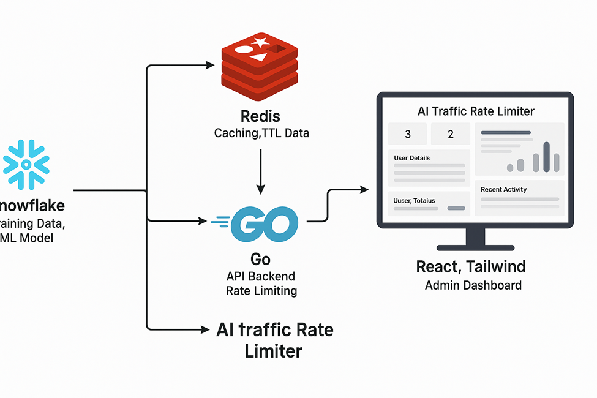

# 🚦 AI Traffic Rate Limiter

A full-stack AI-powered Rate Limiting System with real-time monitoring and analytics. This project integrates Go, Snowflake, Redis, and a React + Tailwind Dashboard to predict and control user request flow intelligently.


---

## 🧠 Overview

This project simulates an intelligent API rate limiter that:
- Predicts user request behavior using machine learning (Snowflake + Snowpark + Python)
- Caches rate limit data in Redis
- Serves API endpoints via a Go backend
- Displays real-time traffic data in a modern React dashboard with TailwindCSS

---

## ⚙️ Tech Stack

| Layer | Technology | Description |
|-------|-----------|-------------|
| **Backend** | Go (Golang) | REST API for rate limiting and admin dashboard endpoints |
| **Database** | Snowflake | Stores historical request and prediction data |
| **Cache** | Redis | Handles rate limit tracking and quick lookups |
| **ML Model** | Snowpark (Python) | Trains and predicts API request behavior |
| **Frontend** | React + TypeScript + TailwindCSS + Recharts | Visual admin dashboard for traffic visualization |
| **Containerization** | Docker | Runs all services together |

---

## 📂 Project Structure
```
ai-traffic-rate-limiter/
│
├── backend/
│   ├── main.go
│   ├── go.mod
│   ├── go.sum
│   └── Dockerfile
│
├── frontend/
│   ├── src/
│   │   ├── components/
│   │   │   ├── Dashboard.tsx
│   │   │   ├── StatCard.tsx
│   │   │   ├── TrafficChart.tsx
│   │   │   └── RequestsTable.tsx
│   │   ├── App.tsx
│   │   ├── index.tsx
│   │   └── styles.css
│   ├── package.json
│   ├── tsconfig.json
│   └── Dockerfile
│
├── ml/
│   ├── snowpark.py
│   └── requirements.txt
│
├── docker-compose.yml
├── README.md
└── .gitignore
```

---

## 🔑 Environment Variables

Create a `.env` file in the `backend` folder with the following:
```env
SNOWFLAKE_ACCOUNT=your_account
SNOWFLAKE_USER=your_username
SNOWFLAKE_PASSWORD=your_password
SNOWFLAKE_WAREHOUSE=COMPUTE_WH
SNOWFLAKE_DATABASE=API_RATE_LIMITER
SNOWFLAKE_SCHEMA=REQUEST_LOGS
REDIS_HOST=redis
REDIS_PORT=6379
```

⚠️ **Never commit this file** — it's included in `.gitignore`.

---

## 🐳 Docker Setup

To build and run all components together:
```bash
docker-compose up --build
```

This will:
- Start Redis
- Start Snowflake connection
- Run Go backend on port `8080`
- Run React dashboard on port `3000`

---

## 🧩 API Endpoints

| Endpoint | Method | Description |
|----------|--------|-------------|
| `/api/predict` | POST | Rate limit API; checks if a user request is allowed |
| `/admin/rate-status` | GET | Admin endpoint for dashboard data |

---

## 📊 Frontend Dashboard Features

- View total users, allowed, and blocked requests
- Real-time traffic chart visualization (Recharts)
- User-wise details: request count, AI decisions, TTL countdown
- Recent activity logs with timestamps

---

## 🧠 Machine Learning Component (Snowpark)

Trains a **Random Forest Classifier** to predict if a user should be allowed or blocked based on:
- Time of request
- Previous request patterns
- Day of week

Model writes predictions back to Snowflake for Go backend to use.

---

## 🖼️ System Architecture



---

## 🚀 Future Enhancements

- [ ] Add authentication for admin dashboard
- [ ] Use Kafka for event-driven logging
- [ ] Integrate Grafana for advanced metrics visualization
- [ ] Deploy to AWS using ECS or Kubernetes

---


---


---

## ⭐ Show your support

Give a ⭐️ if this project helped you!


